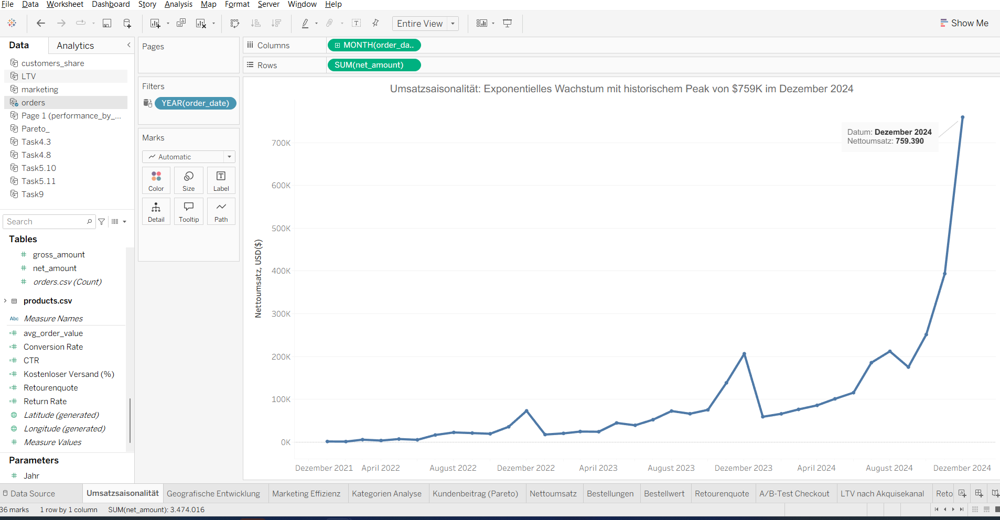
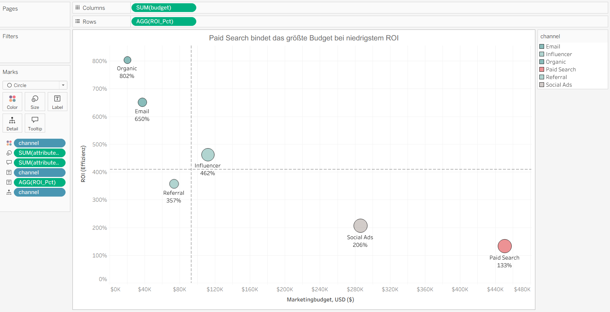
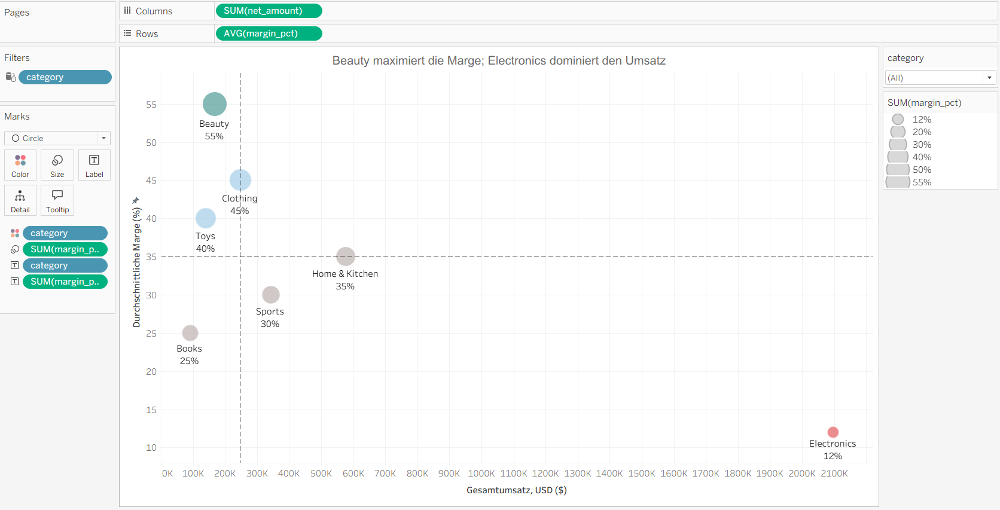
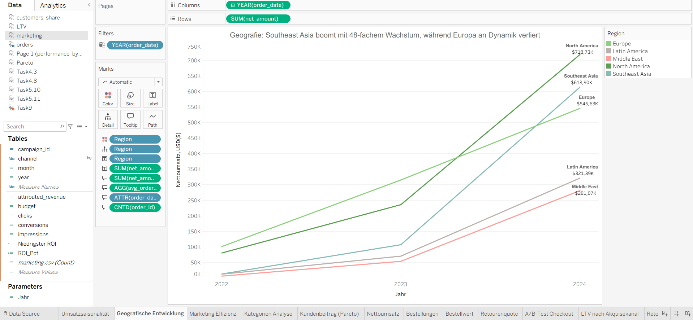
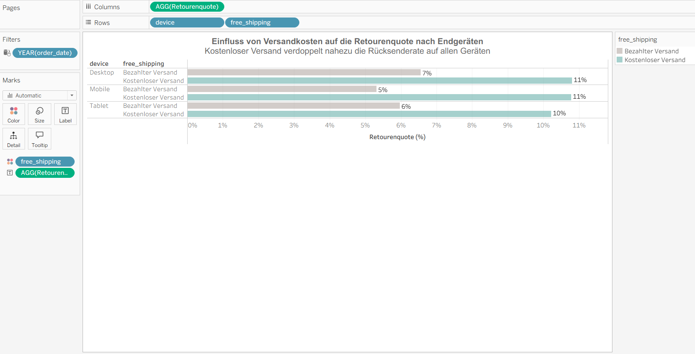
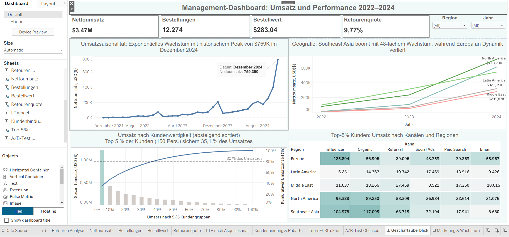
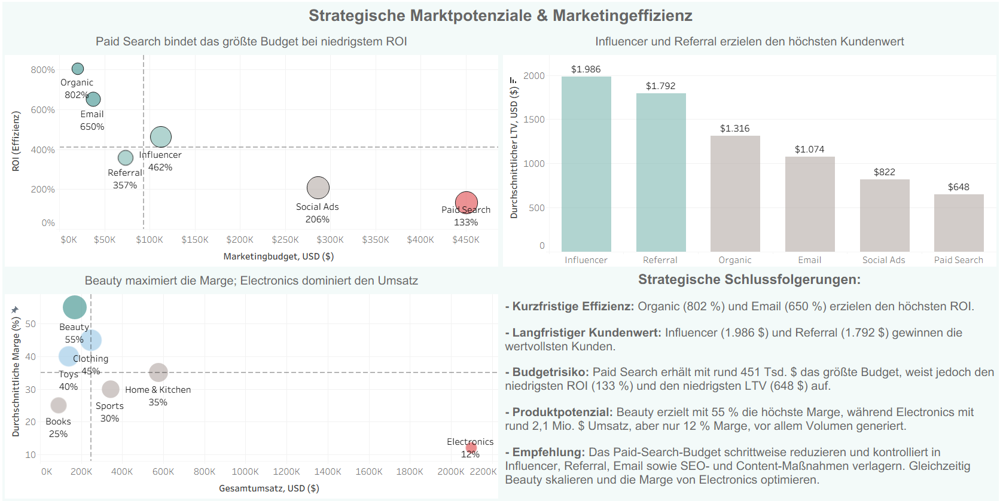
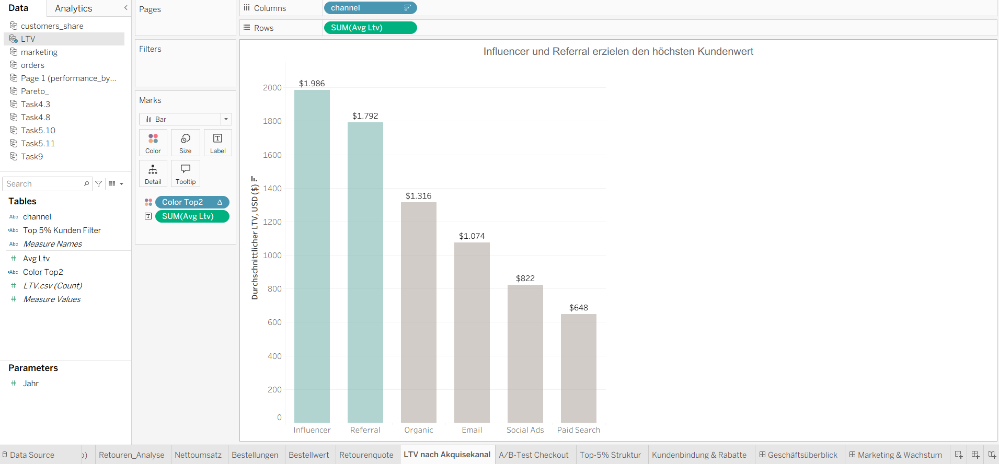
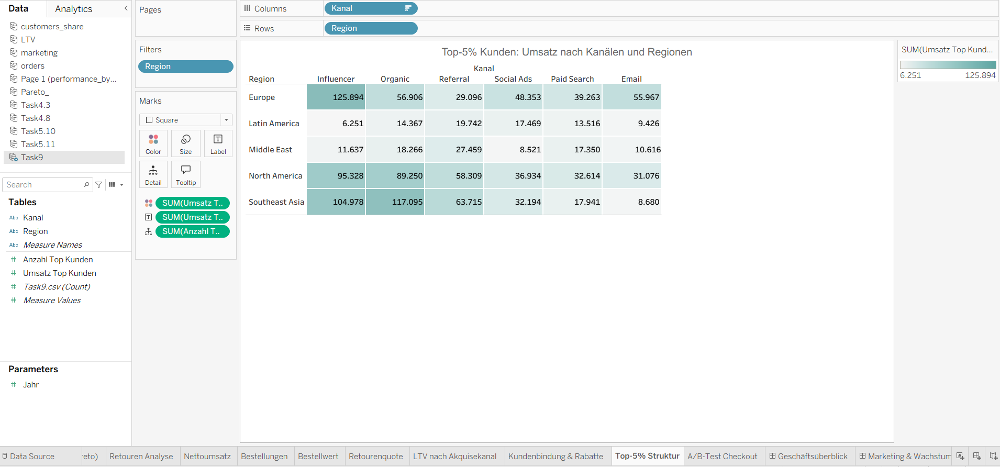
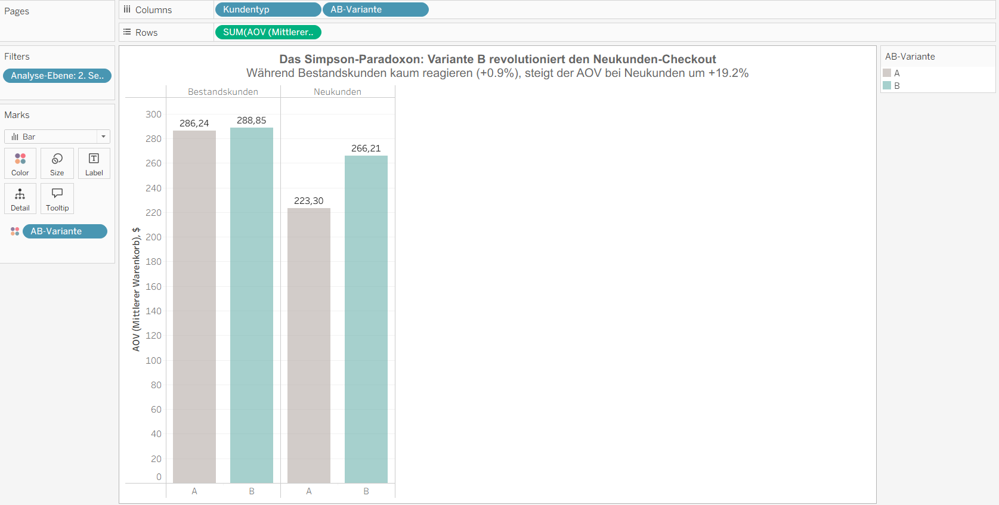

# Finalprojekt: ShopSphere — Analyse eines globalen Marktplatzes

## Angaben zum Autor

- **Studierende:** Alla Yermilko
- **Präsentationsdatum:** 29.07.2026
- **Analysezeitraum:** 2022–2024

## Einleitung

ShopSphere ist ein globaler Online-Marktplatz, der Produkte aus sieben Kategorien in fünf Weltregionen vertreibt. Für die Analyse wurden Daten zu 3 000 Kundinnen und Kunden, 250 Produkten, 12 274 Bestellungen, rund 26 000 Bestellpositionen und 216 Marketingkampagnen aus den Jahren 2022–2024 verwendet.

## Projektziel

Ziel des Projekts ist es, die finanzielle Entwicklung des Unternehmens, die Effizienz der Marketingkanäle, die Rentabilität der Produktkategorien, die regionale Entwicklung, den Kundenwert sowie die Ergebnisse eines A/B-Tests des neuen Checkouts zu untersuchen. Die Analyse verbindet SQL, Tableau, betriebswirtschaftliche Interpretation und statistisches Denken.

### Datengrundlage

| Bereich | Umfang |
| :--- | ---: |
| Analysezeitraum | 2022–2024 |
| Kundinnen und Kunden | 3 000 |
| Produkte | 250 |
| Produktkategorien | 7 |
| Bestellungen | 12 274 |
| Bestellpositionen | ca. 26 000 |
| Marketingkampagnen | 216 |
| Weltregionen | 5 |

### Zentrale KPI

| KPI | Ergebnis |
| :--- | ---: |
| Nettoumsatz | 3 474 016,03 USD |
| Bestellungen | 12 274 |
| Durchschnittlicher Bestellwert | 283,04 USD |
| Retourenquote | 9,77 % |

---

## Block 1. SQL: Datenaufbereitung

### 1.1. Berechnen Sie den Nettoumsatz, die Anzahl der Bestellungen und den durchschnittlichen Bestellwert nach Region und Jahr

```sql
SELECT
    c.region,
    o.order_year,
    ROUND(SUM(o.net_amount), 2) AS total_net_revenue,
    COUNT(DISTINCT o.order_id) AS orders_count,
    ROUND(AVG(o.net_amount), 2) AS avg_order_value
FROM orders AS o
JOIN customers AS c
    ON o.customer_id = c.customer_id
GROUP BY
    c.region,
    o.order_year
ORDER BY
    o.order_year,
    total_net_revenue DESC;
```

Die Abfrage verknüpft `orders` und `customers` über `customer_id` und erstellt eine Auswertung nach Region und Jahr.

#### Ergebnisübersicht

| Region | Jahr | Nettoumsatz, USD | Bestellungen | Ø Bestellwert, USD | Retourenquote |
| :--- | ---: | ---: | ---: | ---: | ---: |
| Europe | 2022 | 100 827,26 | 380 | 265,33 | 7,89 % |
| North America | 2022 | 80 204,08 | 254 | 315,76 | 12,60 % |
| Southeast Asia | 2022 | 12 721,48 | 44 | 289,12 | 4,55 % |
| Latin America | 2022 | 12 138,04 | 54 | 224,78 | 11,11 % |
| Middle East | 2022 | 5 889,80 | 33 | 178,48 | 9,09 % |
| Europe | 2023 | 315 070,82 | 1 101 | 286,17 | 8,99 % |
| North America | 2023 | 235 736,97 | 848 | 277,99 | 10,50 % |
| Southeast Asia | 2023 | 106 973,34 | 335 | 319,32 | 10,75 % |
| Latin America | 2023 | 70 178,83 | 268 | 261,86 | 11,94 % |
| Middle East | 2023 | 53 547,54 | 223 | 240,12 | 9,87 % |
| North America | 2024 | 718 726,68 | 2 632 | 273,07 | 10,30 % |
| Southeast Asia | 2024 | 613 904,12 | 2 029 | 302,56 | 10,15 % |
| Europe | 2024 | 545 631,86 | 1 911 | 285,52 | 9,21 % |
| Latin America | 2024 | 321 390,58 | 1 207 | 266,27 | 7,71 % |
| Middle East | 2024 | 281 074,63 | 955 | 294,32 | 10,68 % |

Die Entwicklung beschleunigt sich deutlich. Im Jahr 2024 führt North America beim absoluten Umsatz, während Southeast Asia die stärkste Wachstumsdynamik zeigt.

### 1.2. Ermitteln Sie die zehn umsatzstärksten Kundinnen und Kunden

```sql
SELECT
    c.customer_id,
    c.region,
    c.acquisition_channel,
    COUNT(DISTINCT o.order_id) AS orders_count,
    ROUND(SUM(o.net_amount), 2) AS total_spent
FROM customers AS c
JOIN orders AS o
    ON c.customer_id = o.customer_id
GROUP BY
    c.customer_id,
    c.region,
    c.acquisition_channel
ORDER BY
    total_spent DESC
LIMIT 10;
```

Die Abfrage ordnet die Kundinnen und Kunden nach ihren kumulierten Nettoausgaben und ergänzt Region, Akquisitionskanal und Bestellanzahl.

#### Top-10-Kunden

| Kunden-ID | Region | Land | Akquisitionskanal | Bestellungen | Gesamtausgaben, USD |
| ---: | :--- | :--- | :--- | ---: | ---: |
| 12 348 | Europe | Spain | Influencer | 43 | 30 360,93 |
| 11 131 | Europe | Spain | Influencer | 41 | 22 546,65 |
| 12 723 | North America | Canada | Referral | 43 | 19 561,76 |
| 10 995 | Europe | UK | Influencer | 32 | 19 496,63 |
| 11 387 | Southeast Asia | Vietnam | Influencer | 35 | 18 730,10 |
| 11 835 | Southeast Asia | Thailand | Referral | 31 | 18 114,42 |
| 11 046 | Europe | UK | Organic | 37 | 17 960,45 |
| 10 837 | North America | Mexico | Influencer | 27 | 17 822,03 |
| 12 965 | Europe | Spain | Email | 32 | 16 732,93 |
| 12 478 | North America | Mexico | Referral | 32 | 16 412,50 |

Influencer und Referral sind in der Spitzengruppe besonders stark vertreten. Hoher Kundenwert entsteht somit nicht ausschließlich durch die Kanäle mit dem größten Budget.

### 1.3. Berechnen Sie für jede Kategorie Umsatz, durchschnittliche Marge und Retourenquote

```sql
WITH category_orders AS (
    SELECT DISTINCT
        p.category,
        o.order_id,
        o.is_returned
    FROM order_items AS oi
    JOIN products AS p
        ON oi.product_id = p.product_id
    JOIN orders AS o
        ON oi.order_id = o.order_id
),
category_revenue AS (
    SELECT
        p.category,
        SUM(oi.line_total) AS total_revenue,
        AVG(p.margin_pct) AS avg_margin_pct
    FROM order_items AS oi
    JOIN products AS p
        ON oi.product_id = p.product_id
    GROUP BY
        p.category
)
SELECT
    cr.category,
    ROUND(cr.total_revenue, 2) AS total_revenue,
    ROUND(cr.avg_margin_pct, 2) AS avg_margin_pct,
    ROUND(
        100.0 * SUM(co.is_returned) / NULLIF(COUNT(co.order_id), 0),
        2
    ) AS return_rate_pct
FROM category_revenue AS cr
JOIN category_orders AS co
    ON cr.category = co.category
GROUP BY
    cr.category,
    cr.total_revenue,
    cr.avg_margin_pct
ORDER BY
    cr.total_revenue DESC;
```

Die separate Bildung eindeutiger Paare aus Kategorie und Bestellung verhindert, dass Retouren mehrfach gezählt werden.

#### Kategorieergebnisse

| Kategorie | Umsatz, USD | Ø Marge | Retourenquote | Retouren | Bestellungen mit Kategorie |
| :--- | ---: | ---: | ---: | ---: | ---: |
| Electronics | 2 097 901,06 | 12,00 % | 15,97 % | 520 | 3 256 |
| Home & Kitchen | 576 134,75 | 35,00 % | 10,27 % | 392 | 3 818 |
| Sports | 343 114,98 | 30,00 % | 8,40 % | 267 | 3 178 |
| Clothing | 248 601,48 | 45,00 % | 16,00 % | 481 | 3 006 |
| Beauty | 168 624,42 | 55,00 % | 9,97 % | 342 | 3 431 |
| Toys | 140 505,55 | 40,00 % | 8,98 % | 271 | 3 017 |
| Books | 90 757,82 | 25,00 % | 8,13 % | 237 | 2 916 |

Electronics erzeugt das größte Volumen, weist jedoch die niedrigste Marge und eine hohe Retourenquote auf. Beauty kombiniert die höchste Marge mit einer deutlich gesünderen Retourenstruktur.

### 1.4. Ermitteln Sie Kundinnen und Kunden mit überdurchschnittlichen Ausgaben und deren Umsatzanteil

```sql
WITH customer_spending AS (
    SELECT
        customer_id,
        SUM(net_amount) AS total_spent
    FROM orders
    GROUP BY customer_id
),
avg_spending AS (
    SELECT AVG(total_spent) AS avg_total_spent
    FROM customer_spending
),
above_avg_customers AS (
    SELECT
        cs.customer_id,
        cs.total_spent
    FROM customer_spending AS cs
    CROSS JOIN avg_spending AS av
    WHERE cs.total_spent > av.avg_total_spent
)
SELECT
    COUNT(*) AS customers_above_average,
    ROUND(SUM(total_spent), 2) AS revenue_from_above_avg_customers,
    ROUND(
        100.0 * SUM(total_spent)
        / NULLIF((SELECT SUM(net_amount) FROM orders), 0),
        2
    ) AS revenue_share_pct
FROM above_avg_customers;
```

#### Ergebnis

| Kennzahl | Wert |
| :--- | ---: |
| Kunden über dem Durchschnitt | 862 |
| Durchschnittliche Ausgaben aller Kunden | 1 158,01 USD |
| Umsatz dieser Kundengruppe | 2 524 753,93 USD |
| Umsatzanteil | 72,68 % |

Nur 862 Kunden liegen über dem Durchschnitt, erwirtschaften aber fast drei Viertel des Gesamtumsatzes. Diese Gruppe ist für Retention und personalisierte Angebote besonders relevant.

### 1.5. Berechnen Sie Budget, zugerechneten Umsatz und ROI je Marketingkanal

```sql
SELECT
    channel,
    ROUND(SUM(budget), 2) AS total_budget,
    ROUND(SUM(attributed_revenue), 2) AS total_attributed_revenue,
    ROUND(
        SUM(attributed_revenue) / NULLIF(SUM(budget), 0),
        2
    ) AS roi
FROM marketing
GROUP BY channel
ORDER BY roi DESC;
```


#### Marketingkanäle

| Kanal | Budget, USD | Zugerechneter Umsatz, USD | ROI, % | Conversions | Kosten je Conversion, USD |
| :--- | ---: | ---: | ---: | ---: | ---: |
| Organic | 20 364 | 163 398 | 802 | 1 881 | 10,83 |
| Email | 37 468 | 243 610 | 650 | 2 794 | 13,41 |
| Influencer | 112 337 | 519 453 | 462 | 5 904 | 19,03 |
| Referral | 73 766 | 263 536 | 357 | 2 958 | 24,94 |
| Social Ads | 286 488 | 589 544 | 206 | 6 738 | 42,52 |
| Paid Search | 450 959 | 598 703 | 133 | 6 829 | 66,04 |

Organic und Email sind kurzfristig am effizientesten. Paid Search bindet das größte Budget, erzielt aber den niedrigsten ROI und die höchsten Kosten je Conversion.

---

## Block 2. Visualisierungen in Tableau

### 2.1. Saisonalität: Gibt es saisonale Spitzen und wann erzielt das Unternehmen den höchsten Umsatz?



Das Liniendiagramm zeigt den monatlichen Nettoumsatz von 2022 bis 2024. Die Gesamtentwicklung ist steigend, jedoch nicht gleichmäßig. Besonders deutlich sind die Spitzen am Ende jedes Jahres. Der höchste Wert des gesamten Zeitraums wurde im Dezember 2024 mit 759 390 USD erreicht.

| Monat | Umsatz, USD | Veränderung zum Vorjahr |
| :--- | ---: | ---: |
| Dezember 2022 | 72 908 | — |
| Dezember 2023 | 206 421 | +183,12 % |
| Dezember 2024 | 759 390 | +267,88 % |

Betriebswirtschaftliche Schlussfolgerung: Das vierte Quartal und insbesondere der Dezember sind für den Jahresumsatz zentral. Bestände, Logistik, Kundenservice und Marketing müssen frühzeitig vorbereitet werden. Gleichzeitig sollte die Nachfrage in schwächeren Monaten stabilisiert werden.

### 2.2. Marketing: Ist das Budget rational verteilt?



Das Streudiagramm stellt das Marketingbudget dem ROI gegenüber.

| Kanal | Budget, USD | Zugerechneter Umsatz, USD | ROI, % | Conversions | Kosten je Conversion, USD |
| :--- | ---: | ---: | ---: | ---: | ---: |
| Organic | 20 364 | 163 398 | 802 | 1 881 | 10,83 |
| Email | 37 468 | 243 610 | 650 | 2 794 | 13,41 |
| Influencer | 112 337 | 519 453 | 462 | 5 904 | 19,03 |
| Referral | 73 766 | 263 536 | 357 | 2 958 | 24,94 |
| Social Ads | 286 488 | 589 544 | 206 | 6 738 | 42,52 |
| Paid Search | 450 959 | 598 703 | 133 | 6 829 | 66,04 |

Die größten Budgets fließen nicht in die effizientesten Kanäle. Paid Search und Social Ads sind deshalb die wichtigsten Auditfelder. Ein Teil des Budgets sollte kontrolliert in Influencer, Referral, Email sowie SEO- und Content-Maßnahmen umgeschichtet werden. Eine sofortige vollständige Abschaltung wäre wegen Attributions- und Skalierungsrisiken nicht sachgerecht.

### 2.3. Kategorien: Welche Kategorien sind „Hidden Diamonds“?



Das Streudiagramm vergleicht Umsatz und durchschnittliche Marge; die Retourenquote dient als zusätzlicher Risikokontext.

| Kategorie | Umsatz, USD | Ø Marge | Retourenquote | Retouren | Bestellungen mit Kategorie |
| :--- | ---: | ---: | ---: | ---: | ---: |
| Electronics | 2 097 901,06 | 12,00 % | 15,97 % | 520 | 3 256 |
| Home & Kitchen | 576 134,75 | 35,00 % | 10,27 % | 392 | 3 818 |
| Sports | 343 114,98 | 30,00 % | 8,40 % | 267 | 3 178 |
| Clothing | 248 601,48 | 45,00 % | 16,00 % | 481 | 3 006 |
| Beauty | 168 624,42 | 55,00 % | 9,97 % | 342 | 3 431 |
| Toys | 140 505,55 | 40,00 % | 8,98 % | 271 | 3 017 |
| Books | 90 757,82 | 25,00 % | 8,13 % | 237 | 2 916 |

Electronics dominiert den Umsatz mit rund 2,1 Mio. USD, erzielt aber nur 12 % Marge. Beauty erreicht bei einem Umsatz von rund 168,6 Tsd. USD eine Marge von 55 % und ist damit der überzeugendste „Hidden Diamond“.

### 2.4. Regionale Entwicklung: Welche Region wächst am schnellsten?



| Region | Umsatz 2022, USD | Umsatz 2024, USD | Einordnung |
| :--- | ---: | ---: | :--- |
| North America | 80 204,08 | 718 726,68 | Höchster absoluter Umsatz 2024 |
| Southeast Asia | 12 721,48 | 613 904,12 | Mehr als 48-faches Wachstum |
| Europe | 100 827,26 | 545 631,86 | Weiteres Wachstum, aber relativ geringste Dynamik |
| Latin America | 12 138,04 | 321 390,58 | Starkes Wachstum von kleiner Basis |
| Middle East | 5 889,80 | 281 074,63 | Starkes Wachstum von kleiner Basis |

Southeast Asia ist der wichtigste Markt für die weitere Expansion. North America bleibt beim absoluten Umsatz führend. In Europe sollte der Schwerpunkt stärker auf Bindung, Personalisierung und Wiederkäufen liegen.

### 2.5. Kundenbeitrag: Welchen Umsatzanteil erzielen die Top-Kunden?

.png)

| Kundengruppe | Kunden | Umsatz, USD | Umsatzanteil |
| :--- | ---: | ---: | ---: |
| Top 5 % | 150 | 1 218 211,48 | 35,07 % |
| Übrige 95 % | 2 850 | 2 255 804,55 | 64,93 % |

Das Ergebnis zeigt eine relevante Konzentration, bestätigt jedoch nicht die klassische 80/20-Regel. Die Top 5 % benötigen ein eigenes Bindungsprogramm; zugleich darf die breite Kundenbasis nicht vernachlässigt werden.

### 2.6. Kreative Analyse: Versandbedingung und Retouren



| Endgerät | Kostenpflichtiger Versand | Kostenloser Versand | Differenz |
| :--- | ---: | ---: | ---: |
| Desktop | 7 % | 11 % | +4 Prozentpunkte |
| Mobile | 5 % | 11 % | +6 Prozentpunkte |
| Tablet | 6 % | 10 % | +4 Prozentpunkte |

Die Retourenquote ist bei kostenlosem Versand auf allen Geräten höher. Der entscheidende Faktor ist hier nicht das Endgerät, sondern die Versandbedingung. Der beobachtete Zusammenhang beweist jedoch keine Kausalität, da sich Bestellwert, Warenkorbgröße und Kategorienmix unterscheiden können.

---

## Block 3. Interaktive Dashboards für die Geschäftsleitung

### 3.1. Management-Dashboard mit KPI, Visualisierungen und Filtern

Die analytische Lösung besteht aus zwei Seiten: **„Geschäftsüberblick“** und **„Marketing & Wachstum“**.

#### Dashboard 1. Geschäftsüberblick



| Bereich | Inhalt | Managementfrage |
| :--- | :--- | :--- |
| KPI-Karten | Umsatz, Bestellungen, AOV, Retourenquote | Wie steht das Geschäft insgesamt? |
| Saisonalität | Monatlicher Umsatz 2022–2024 | Wann entsteht das Wachstum? |
| Regionen | Umsatzentwicklung nach Region | Wo entsteht das Wachstum? |
| Pareto | Kumulierter Kundenbeitrag | Wie konzentriert ist der Umsatz? |
| Top-5-%-Heatmap | Region × Akquisitionskanal | Woher kommen die wertvollsten Kunden? |

Die Filter `Region` und `Jahr` gelten für kompatible Arbeitsblätter der primären Datenquelle. Pareto und Heatmap basieren auf separaten aggregierten Quellen und bilden den Gesamtzeitraum 2022–2024 ab.

#### Dashboard 2. Marketing & Wachstum



| Visualisierung | Kennzahlen | Entscheidungszweck |
| :--- | :--- | :--- |
| Marketingbudget — ROAS | Budget, ROAS | Kurzfristige Ausgabeneffizienz |
| LTV nach Kanal | Beobachteter Kunden-LTV | Langfristige Kundenqualität |
| Umsatz — Marge | Kategorieumsatz, Marge, Retouren | Profitables Produktwachstum |
| Strategischer Textblock | Prioritäten und Risiken | Konkrete Managemententscheidung |

### 3.2. Kompositionslogik

Die Geschichte folgt der Reihenfolge:

**Ergebnis → zeitliche und regionale Wachstumstreiber → Kundenwert → Marketingeffizienz → Produktrentabilität → Managemententscheidung.**

### 3.3. Drei Erkenntnisse in den ersten 30 Sekunden

| Nr. | Kernaussage | Bedeutung |
| ---: | :--- | :--- |
| 1 | 3,47 Mio. USD Umsatz; Monatsrekord 759 390 USD im Dezember 2024 | Starkes Wachstum mit hoher Saisonalitätsabhängigkeit |
| 2 | Paid Search: größtes Budget, niedrigster ROI und niedrigster LTV | Budgetallokation muss geprüft werden |
| 3 | Top 5 %: 35,07 % Umsatz; Southeast Asia wächst am schnellsten; Beauty hat 55 % Marge | Retention, Expansion und margenstarke Kategorien verbinden |

---

## Block 4. Strategische Business Cases

### 4.3. Welcher Kanal erzielt den höchsten beziehungsweise niedrigsten ROI?

| Kanal | Budget, USD | Zugerechneter Umsatz, USD | ROI, % | Conversions | Kosten je Conversion, USD |
| :--- | ---: | ---: | ---: | ---: | ---: |
| Organic | 20 364 | 163 398 | 802 | 1 881 | 10,83 |
| Email | 37 468 | 243 610 | 650 | 2 794 | 13,41 |
| Influencer | 112 337 | 519 453 | 462 | 5 904 | 19,03 |
| Referral | 73 766 | 263 536 | 357 | 2 958 | 24,94 |
| Social Ads | 286 488 | 589 544 | 206 | 6 738 | 42,52 |
| Paid Search | 450 959 | 598 703 | 133 | 6 829 | 66,04 |

Organic erzielt den höchsten ROI, Paid Search den niedrigsten. Gleichzeitig erhält Paid Search den größten Budgetanteil. Die Ausgabenstruktur ist unausgewogen, darf aber nur über kontrollierte Tests verändert werden.

### 4.4. Stimmen ROI und langfristiger Kundenwert überein?



| Kanal | Ø beobachteter LTV, USD | ROI, % |
| :--- | ---: | ---: |
| Influencer | 1 985,73 | 462 |
| Referral | 1 791,82 | 357 |
| Organic | 1 316,13 | 802 |
| Email | 1 074,46 | 650 |
| Social Ads | 822,09 | 206 |
| Paid Search | 648,10 | 133 |

Die Ergebnisse stimmen nur teilweise überein. Organic und Email führen bei der kurzfristigen Effizienz, Influencer und Referral beim langfristigen Kundenwert. Paid Search ist in beiden Perspektiven der schwächste Kanal.

### 4.5. Wie soll das Budget umverteilt werden?

| Kanal | Empfohlene Maßnahme | Begründung | Hauptrisiko |
| :--- | :--- | :--- | :--- |
| Paid Search | In Tests um 30–40 % reduzieren | Niedrigster ROAS und LTV | Verlust von Erstkontakten oder saisonalem Volumen |
| Social Ads | Ineffiziente Kampagnen selektiv kürzen | Zweitniedrigster ROAS | Upper-Funnel-Wirkung wird unterschätzt |
| Influencer | Kontrolliert ausbauen | Höchster LTV | Begrenzte Skalierbarkeit |
| Referral | Kontrolliert ausbauen | Zweithöchster LTV | Sinkende Grenzerträge |
| Email | Beibehalten oder moderat ausbauen | Sehr hoher ROAS | Sättigung bestehender Kontakte |
| Organic | SEO, Content und Technik stärken | Höchster ROAS | Langsamer Kapazitätsaufbau |

### 4.6. Welche Kategorie erzeugt eine „Volumenillusion“?

| Kategorie | Umsatz, USD | Marge | Retourenquote | Einordnung |
| :--- | ---: | ---: | ---: | :--- |
| Electronics | 2 097 901,06 | 12,00 % | 15,97 % | Größtes Volumen, schwächste Marge |
| Beauty | 168 624,42 | 55,00 % | 9,97 % | Kleineres Volumen, höchste Marge |
| Clothing | 248 601,48 | 45,00 % | 16,00 % | Hohe Marge, aber hohes Retourenrisiko |

Electronics sollte als Umsatztreiber erhalten bleiben. Einkauf, Preisgestaltung, Sortiment und Retourenkontrolle müssen jedoch verbessert werden.

### 4.7. Welche Kategorie ist der „Hidden Diamond“?

Beauty ist der überzeugendste „Hidden Diamond“.

| Kriterium | Beauty | Managementfolgerung |
| :--- | ---: | :--- |
| Umsatz | 168 624,42 USD | Noch begrenztes Volumen |
| Marge | 55,00 % | Höchste Marge aller Kategorien |
| Retourenquote | 9,97 % | Deutlich gesünder als Electronics und Clothing |
| Strategie | Schrittweise Skalierung | Sortiment, Cross-Selling und eigene Kampagnen ausbauen |

### 4.8. Binden sich stark rabattorientierte Kunden langfristig?


| Segment | Ø Bestellungen | Ø LTV, USD | Einmalkäuferanteil |
| :--- | ---: | ---: | ---: |
| Rabattorientiert, >20 % | 2,17 | 384 | 25,0 % |
| Übrige Kunden | 4,35 | 1 261 | 16,6 % |

Stark rabattorientierte Kunden kaufen ungefähr halb so häufig, weisen einen rund 70 % niedrigeren LTV auf und bleiben häufiger Einmalkäufer. Flächendeckende Rabatte sollten durch personalisierte Wiederkaufsanreize, Bundles und Loyalitätsmechaniken ersetzt werden.

### 4.9. Welchen Umsatzanteil erzielen die Top 5 % und wer sind diese Kunden?



| Region | Kanal | Kunden | Umsatz, USD | Ø LTV, USD |
| :--- | :--- | ---: | ---: | ---: |
| Europe | Influencer | 12 | 125 893,67 | 10 491,14 |
| Southeast Asia | Organic | 12 | 117 095,03 | 9 757,92 |
| Southeast Asia | Influencer | 10 | 104 977,69 | 10 497,77 |
| North America | Influencer | 11 | 95 327,87 | 8 666,17 |
| North America | Organic | 10 | 89 250,25 | 8 925,02 |

Die Top 5 % umfassen 150 Personen und generieren 35,07 % des Gesamtumsatzes. Für dieses Segment empfiehlt sich ein VIP-Programm ohne tiefe Rabatte: früher Zugang, priorisierter Support, personalisierte Empfehlungen und Trigger-Kommunikation bei sinkender Aktivität.

---

## Block 5. Statistisches Denken: A/B-Experiment

### 5.10. Vergleich der Gruppen A und B insgesamt

| Variante | Bestellungen | Ø Bestellwert, USD | Differenz zu A |
| :--- | ---: | ---: | ---: |
| A | 3 681 | 281,73 | — |
| B | 3 674 | 287,27 | +5,54 USD / +2,0 % |

Deskriptiv liegt B rund 2,0 % über A. Der Gesamtmittelwert beweist jedoch weder statistische Signifikanz noch einen positiven Gesamteffekt auf Conversion und Deckungsbeitrag.

### 5.11. Vergleich nach Kundentyp



| Kundentyp | Variante A: Bestellungen | AOV A, USD | Variante B: Bestellungen | AOV B, USD | Veränderung B |
| :--- | ---: | ---: | ---: | ---: | ---: |
| Neukunden | 264 | 223,30 | 256 | 266,21 | +42,91 USD / +19,2 % |
| Bestandskunden | 3 417 | 286,24 | 3 418 | 288,85 | +2,61 USD / +0,9 % |

Der praktisch relevante Effekt konzentriert sich fast vollständig auf Neukunden. Bei Bestandskunden ist der Unterschied minimal. Da sich die Wirkungsrichtung nicht umkehrt, ist „verborgene Effektheterogenität“ methodisch präziser als ein klassisches Simpson-Paradoxon.

### 5.12. Für welche Kundengruppe soll Variante B eingeführt werden?

| Zielgruppe | Empfehlung | Zu überwachende Kennzahlen |
| :--- | :--- | :--- |
| Neukunden | Gezielter Rollout oder weiterführender Test | Conversion, AOV, Checkout-Abbrüche, Retouren, Deckungsbeitrag |
| Bestandskunden | Kein allgemeiner Rollout auf Basis der vorliegenden Daten | AOV, Conversion, Wiederkaufrate, Supportkontakte |
| Alle Nutzer | Derzeit nicht begründet | Gesamter Umsatz je Session und Profitabilität |

Vor einer endgültigen Entscheidung sind Signifikanztest, Konfidenzintervall und Effektgröße erforderlich. Ohne Daten zu allen Checkout-Sessions kann die Conversion nicht vollständig bewertet werden.

### 5.13. Faire und manipulative Darstellung

| Darstellung | Aussage | Warum problematisch? |
| :--- | :--- | :--- |
| B „verkaufen“ | „Der AOV steigt bei Neukunden um 19,2 %.“ | Neukunden bilden nur etwa 7 % der Experimentbestellungen |
| B „begraben“ | „Bei Bestandskunden beträgt der Anstieg nur 0,9 %.“ | Der starke positive Effekt bei Neukunden wird verschwiegen |
| Faire Darstellung | Gesamt +2,0 %, Neukunden +19,2 %, Bestandskunden +0,9 % | Zeigt Aggregat, Segmente, Stichproben und Grenzen gemeinsam |

Eine faire Darstellung muss außerdem Stichprobengrößen, Konfidenzintervalle, p-Wert, Effektgröße und das Fehlen einer vollständigen Conversion-Kennzahl nennen.

---

## Abschließende Empfehlungen für die Geschäftsleitung

| Priorität | Maßnahme | Erwarteter Effekt |
| ---: | :--- | :--- |
| 1 | Paid Search und ineffiziente Social-Ads-Kampagnen schrittweise reduzieren | Geringere Budgetbindung in schwachen Kanälen |
| 2 | Mittel kontrolliert in Influencer, Referral, Email, SEO und Content verlagern | Bessere Kombination aus ROI und LTV |
| 3 | Electronics wirtschaftlich optimieren | Höhere Marge bei Erhalt des Umsatzvolumens |
| 4 | Beauty ohne tiefe Massenrabatte skalieren | Profitables Kategorienwachstum |
| 5 | Southeast Asia priorisieren; Europe stärker auf Retention ausrichten | Nutzung von Wachstum und Stabilisierung reiferer Märkte |
| 6 | VIP-Programm für die Top 5 % aufbauen | Bindung von 35,07 % des Umsatzes |
| 7 | Tiefe Rabatte durch Wiederkaufsmechaniken ersetzen | Höhere Bestellfrequenz und höherer LTV |
| 8 | Checkout B gezielt für Neukunden testen oder ausrollen | Nutzung des AOV-Potenzials bei kontrolliertem Risiko |

> Nachhaltiges Wachstum entsteht nicht durch die isolierte Maximierung des Umsatzes, sondern durch die gemeinsame Steuerung von Umsatz, Marge, Retouren, ROI, LTV und Kundenbindung.
